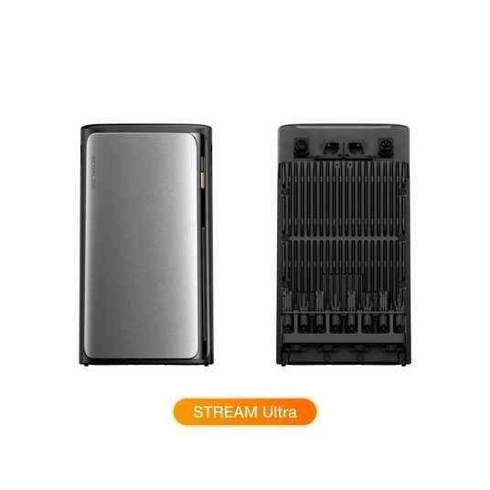
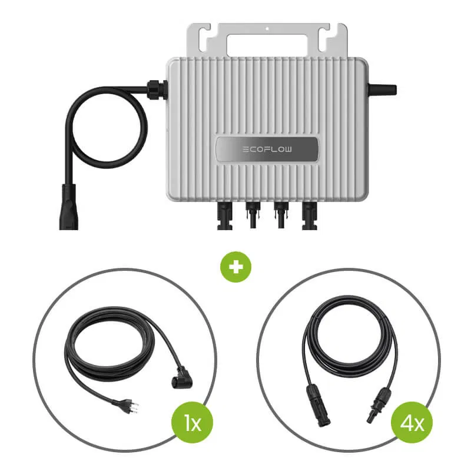
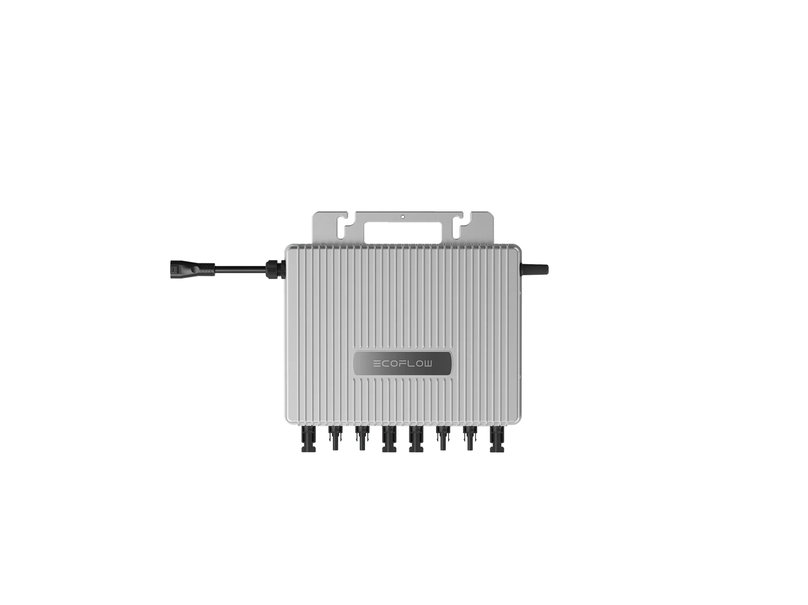
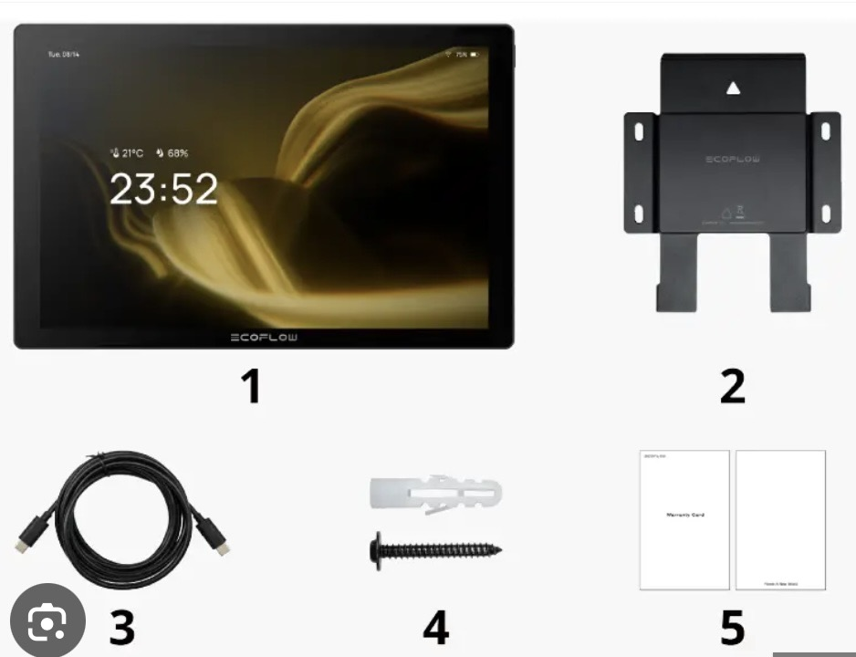
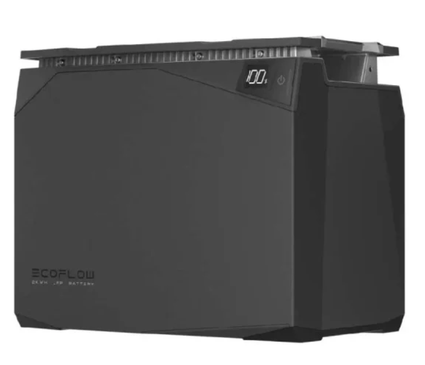
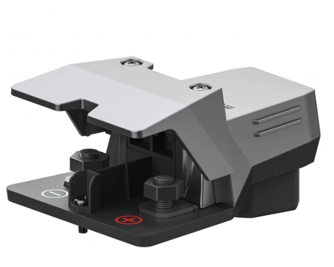
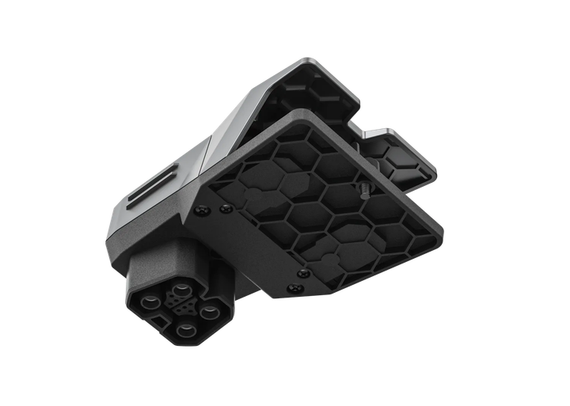
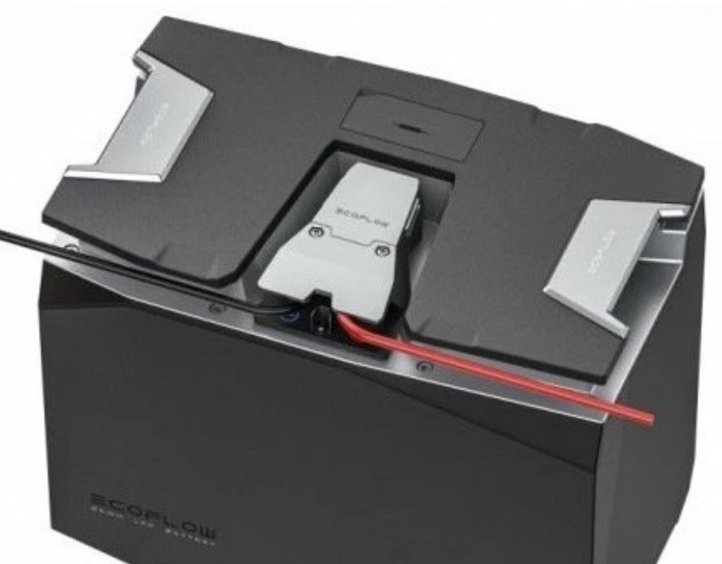
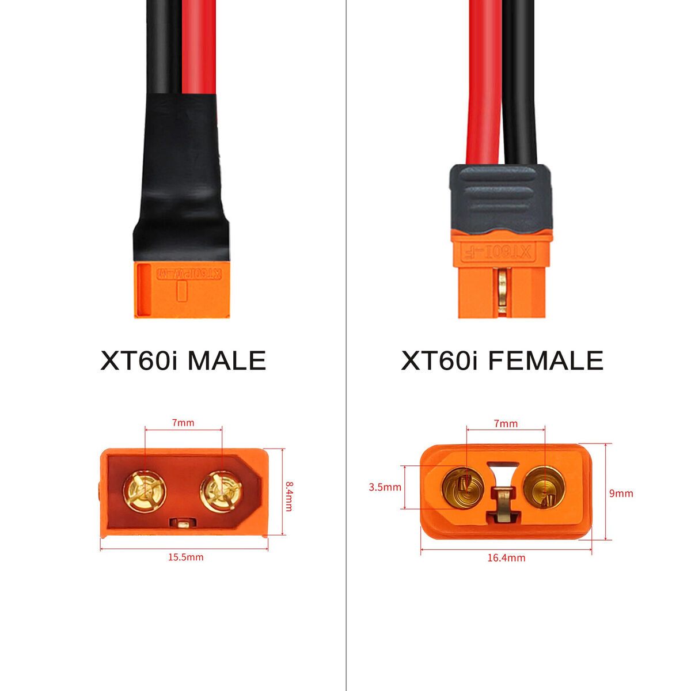

# EcoFlow Ecosystem & Accessories History

This document catalogs the "Eco-system" products that go beyond the basic power stations.

## ☀️ PowerStream (Balcony Solar System) (May 2023)
*   **Status**: **EOL (End of Life)**; replaced by the **EcoFlow STREAM** series.
*   **Type**: Microinverter (Grid-Tied).
*   **Specs**: 800W AC Output (Grid) / 800W PV Input.
*   **Battery Port**: 600W DC Input/Output. Connects to almost ALL EcoFlow power stations (Delta/River) acting as a massive battery buffer.
*   **Unique Feature**: Feeds solar to your home grid (Base load) and stores excess in the battery via a proprietary BKW-Battery cable.
*   **Successor**: **EcoFlow STREAM Microinverter** & **STREAM Ultra**.

---

## 🌊 EcoFlow STREAM Series (Plug-and-Play Home Solar) (2024/2025)
The evolution of the balcony solar concept, moving to integrated stackable units and high-power microinverters. Managed via the **EcoFlow OASIS AI** platform.

### STREAM Ultra (All-in-One System)
A stackable home battery system with an integrated grid-tied inverter.
*   **Models**: 
    *   **Ultra**: 1.92 kWh (Base) | ~23.1 kg.
    *   **Ultra X**: 3.84 kWh (Large) | ~38.8 kg.
*   **Solar Input**: 2000W (4x MPPT @ 500W each | 16-60V).
*   **AC Output**: 1200W (Grid-tied) | 2300W Bypass.
*   **Expansion**: Stack up to 6 units (Max 11.52 kWh for Ultra / 23 kWh for Ultra X).
*   **Durability**: IP65 / NEMA 4.
*   **Life Cycles**: 6000 cycles to 70% capacity.

### STREAM Microinverter
Next-gen standalone microinverter for use with existing rigid/flexible panels.
*   **PV Input**: 1200W Max (3x MPPT | 16-60V).
*   **AC Output**: 800W (Standard) / 600W (Software Limited).
*   **Cooling**: Upgraded thermal sink design (No more overheating issues from V1).
*   **Durability**: IP67 (Full outdoor immersion protection).

### The OASIS AI Ecosystem
*   **Energy Optimization**: Uses weather forecasting to predict solar yield and optimize battery usage.
*   **PowerInsight 2**: The dedicated 10-inch touch console for the STREAM series. Supports Matter 1.4 for third-party smart home integration.
     
*   **Stacking Technology**: Proprietary high-current pins on the top/bottom of Ultra modules (No external battery cables needed for stacking).

#### Comparison: PowerStream vs. STREAM Series
| Feature | PowerStream (V1) | STREAM Series (V2) |
| :--- | :--- | :--- |
| **System Type** | Microinverter only | Integrated (Ultra) or Pro Micro |
| **Solar Max** | 800W | 1200W (Micro) / 2000W (Ultra) |
| **MPPTs** | 2 | 3 (Micro) / 4 (Ultra) |
| **IP Rating** | IP67 | IP67 (Micro) / IP65 (Ultra) |
| **AI Control** | Basic App | OASIS AI (Predictive) |

---

## 🚗 Alternator Charger (June 2024)
*   **Type**: DC-DC Charger (Input from Car Alternator).
*   **Specs**: 800W Charging Speed.
*   **Input**: 11V-35V (Works with 12V/24V systems).
*   **Output**: 40V-60V (Targeting Delta 2/Max/Pro battery voltage).
*   **Key Advantage**: Charges a Delta 2 Max in ~2.5 hours while driving (vs 8+ hours on cig lighter).
*   **Tech**: GaN (Gallium Nitride) for compactness.
*   **Reverse Charging**: Can maintaining vehicle battery from the Power Station (Jump Start/Trickle).

## 🧊 Smart Devices (Glacier, Wave, Blade)

In 2023, EcoFlow expanded into "Smart Devices" that use their battery tech.

### EcoFlow WAVE 2 (May 2023)
*   **Status**: **Current Model**.
*   **Replacement for**: EcoFlow WAVE (Original).
*   **Type**: Portable Air Conditioner & Heater.
*   **Performance**: 5100 BTU Cooling / 6100 BTU Heating.
*   **Battery**: Uses add-on battery (1159Wh) or connects to Delta 2/Max/Pro.
*   **Runtime**: ~8 hours (Eco Mode).
*   **Refrigerant**: R290 (Green).

### EcoFlow GLACIER (April 2023)
*   **Type**: Portable Fridge/Freezer + Ice Maker.
*   **Key Feature**: Integrated Ice Maker (18 cubes in 12 mins).
*   **Battery**: 298Wh plug-in battery (optional).
*   **Cooling**: Dual Zone (-25°C to 10°C).

### EcoFlow BLADE (April 2023)
*   **Type**: Robotic Lawnmower with Lawn Sweeping Kit.
*   **Key Tech**: RTK GPS (No perimeter wire needed).
*   **Status**: **Officially Discontinued** (Late 2023). Mixed reception due to complexity and navigation issues compared to competitors. EcoFlow has pivoted back to core energy storage products.

---

## ⚙️ Generators (Dual Fuel)

Smart generators designed to auto-start and charge the power stations efficiently.

### Smart Generator 4000 (Dual Fuel) (2024)
*   **Output**: 4000W Peak / 3200W Continuous.
*   **Fuel**: Gasoline + LPG (Propane).
*   **Efficiency**: 40% fuel savings vs traditional generators when paired with Delta Pro 3.
*   **Connectivity**: App control, Auto-Start when Delta battery hits X%.

### Smart Generator (Original Dual Fuel) (Dec 2022)
*   **Output**: 1800W (Gas) / 1600W (LPG).
*   **Engine**: 80cc 4-stroke.
*   **Integration**: Seamless DC charging for Delta Pro/Max (Higher efficiency than AC charging).

---

## 🚐 Power Kits & Standalone LFP Batteries

The "Power Kit" system is modular, but some components (batteries) are useful standalone.

### Standalone LFP Batteries (2kWh / 5kWh)
*   **SKU (2kWh)**: `efm100-bpb`
*   **SKU (5kWh)**: `efm100-bpb-5k`
*   **Chemistry**: LiFePO4 (LFP) - 3000-3500 cycles.
*   **Voltage**: 51.2V Nominal (16S).
*   **Capacity & Form Factor**:
    *   **2kWh**: 40Ah | ~17.1 kg (37.7 lbs) | 348 x 198 x 285 mm.
    *   **5kWh**: 100Ah | ~40.6 kg (89.5 lbs) | 500 x 260 x 300 mm.
*   **Features**: Built-in BMS, Auto-Heating (works down to -20°C).
*   **System Rules**: You **cannot mix** 2kWh and 5kWh batteries in a single system. Max 3 batteries total (15kWh).

### LFP Battery Polarity Adapter
*   **SKU**: `AB-CONV-PLUG`
*   **Purpose**: Adapts the proprietary EcoFlow battery port to standard terminals & CAN Bus for third-party systems.
*   **Communication (RJ45 CAN Port Pinout)**:
    *   **Pin 1**: Wake / 12V Trigger
    *   **Pin 2**: CAN High (H)
    *   **Pin 5**: CAN Low (L)
    *   **Pin 6**: Ground (GND)
*   **Note**: Requires an **RJ45 Terminator** on the last battery in the chain for stable comms.

 
 <i>Left: Top view (Terminals) | Right: Bottom view (Battery Interface)</i>
*   **Power Hub**: The 5-in-1 brain (Inverter + DC-DC + MPPT) usually required if not using the Polarity Adapter.

### Power Kit System Architecture (Mid-2022)
*   **Power Hub**: Combines 2x MPPT, DC-DC Charger, Inverter, and DC-DC Converter.
    *   *Input*: Solar (4800W), Alternator (1000W), Shore Power (3000W).
    *   *Output*: 3600W AC (120V).
*   **AC/DC Distribution Panel**: Manages 6 AC circuits and 12 DC circuits.
*   **Console**: Central control panel for monitoring and settings.
*   **Smart Home Panel Integration**: Can connect to the EcoFlow Smart Home Panel for whole-home backup.

---

## ⚡ XT60/XT60i Hack: LFP Battery to Portable Station

You can use a **2kWh/5kWh Power Kit Battery** + **Polarity Adapter (AB-CONV-PLUG)** as a massive external battery for portable units like the Delta 2 or Delta Max.

### The Setup:
`LFP Battery` -> `Polarity Adapter` -> `XT60/XT60i Cable` -> `Portable Station (Solar Input)`

### The "3rd Pin" (XT60i) Logic:
EcoFlow uses the middle 3rd pin to detect the source.
*   **Pin Grounded/Detected**: Unit identifies as **Solar** (Full power).
*   **Pin Open**: Unit identifies as **Car Charging** (Limited to ~8A).

| Main Unit | Cable Type | Speed | Result |
| :--- | :--- | :---: | :--- |
| **Delta 2** | **XT60i** (3rd pin on) | **500W** | Works perfectly as a high-speed DC buffer. |
| **Delta Max 1600**| **Standard XT60** (2-pin) | **200W** | Stable charging. |
| **Delta Max 1600**| **XT60i** (3-pin) | **FAIL** | **MPPT Cycle Loop**: The station tries to draw too much, fails, and restarts the MPPT every few seconds. |

**Hack Tip**: If you are using an XT60i cable with an older unit like the **Delta Max 1600** and it kept rebooting, simply cover the middle pin with **tape** or use a simple 2-pin XT60 cable to force it into the stable 200W "Car Mode".
