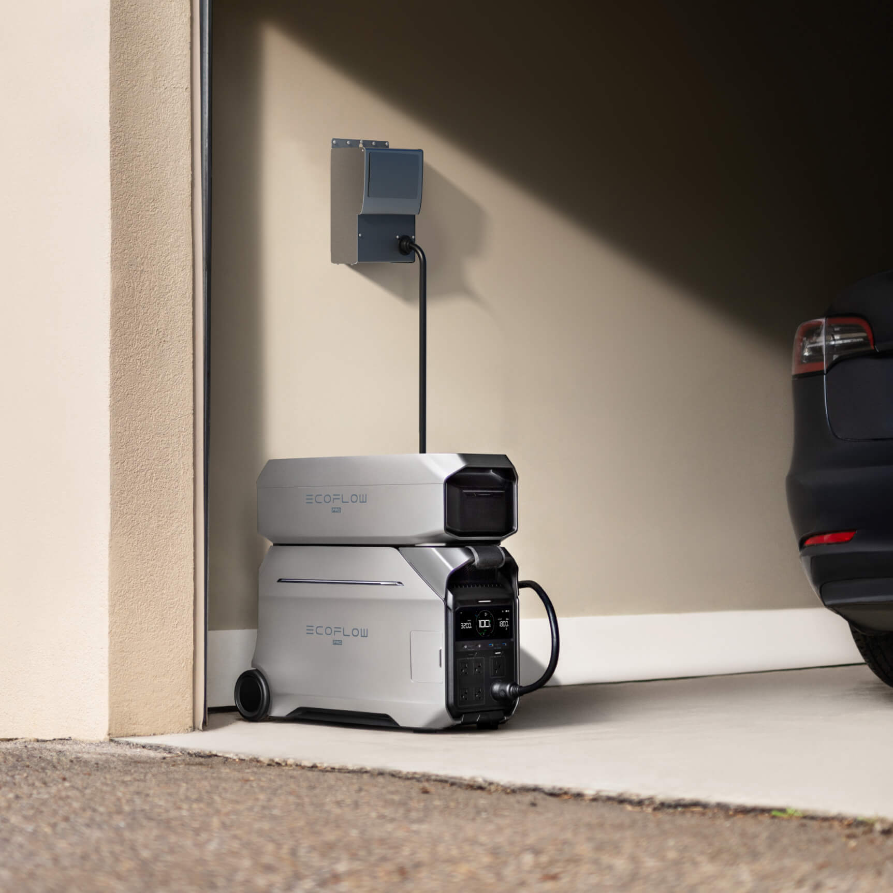
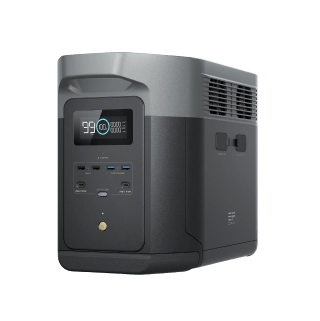
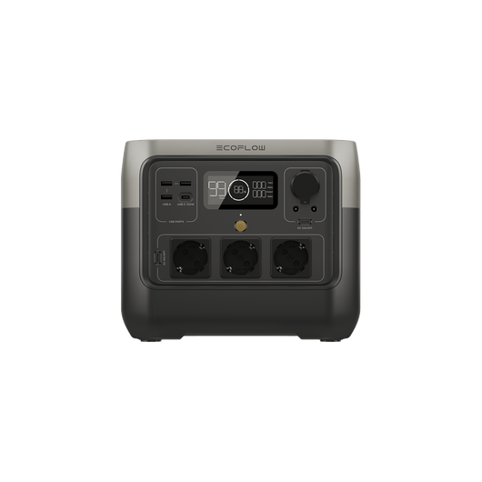
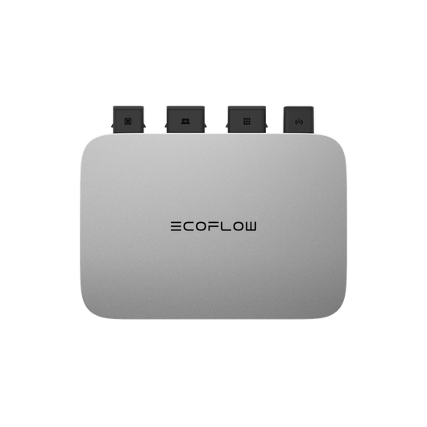

# EcoFlow Device Gallery

This gallery contains the official product images for the devices covered in this guide.

## 🟢 DELTA Series

### DELTA Pro 3

### DELTA 2 Max

---

## 🔵 RIVER Series

### RIVER 2 Pro

---

## ☀️ Ecosystem & Accessories

### PowerStream Microinverter

---

## 🏠 STREAM Home Solar Series (New)

### STREAM Ultra (All-in-One)

### STREAM Microinverters (Standard & Pro)

### PowerInsight 2 Console

---

## 🚐 Power Kits & Modular LFP Batteries

### 2kWh LFP Battery (efm100-bpb)

### Polarity Adapter (AB-CONV-PLUG)

---

### Alternator Charger (800W)

### Cross-Generation Connections
#### Pro 3 EB to Delta 3 Scheme

#### Delta 3 Series Official Compatibility Table

#### XT60 vs XT60i Pinout (The Hack)

