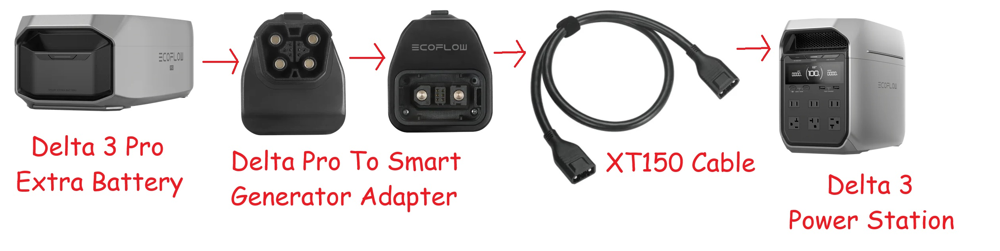
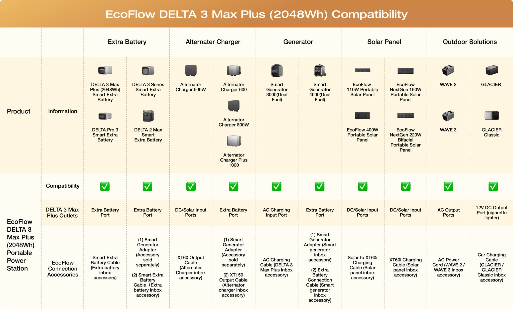

# EcoFlow Device Gallery

This gallery contains the official product images for the devices covered in this guide.

## 🟢 DELTA Series

### DELTA Pro 3

### DELTA 2 Max

---

## 🔵 RIVER Series

### RIVER 2 Pro

---

## ☀️ Ecosystem & Accessories

### PowerStream Microinverter

### Alternator Charger (800W)

### Cross-Generation Connections
#### Pro 3 EB to Delta 3 Scheme

#### Delta 3 Series Official Compatibility Table

