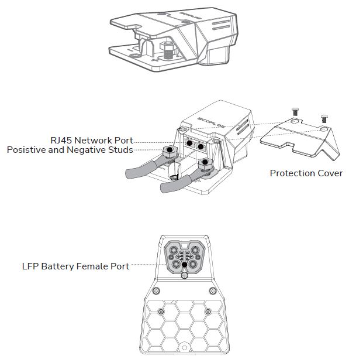
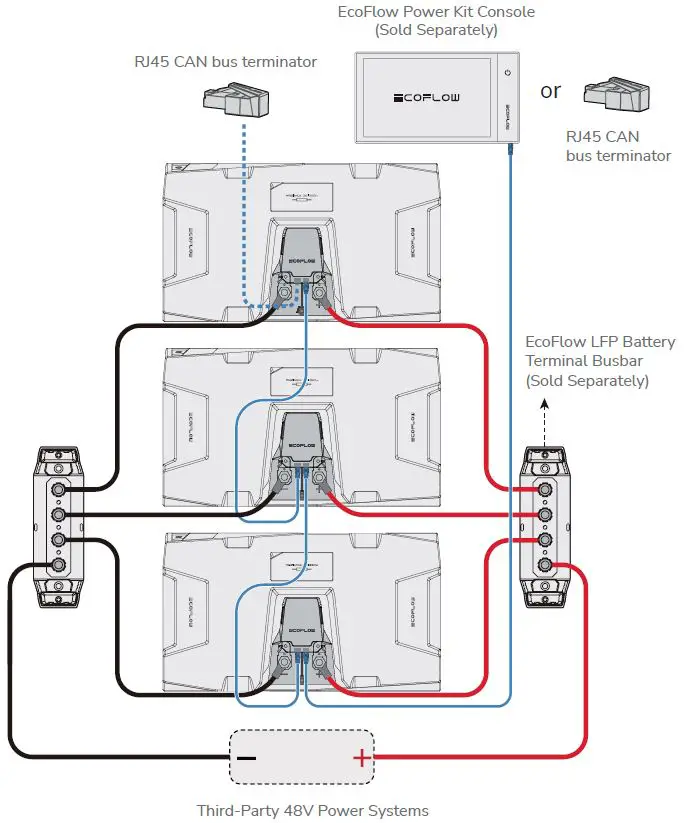
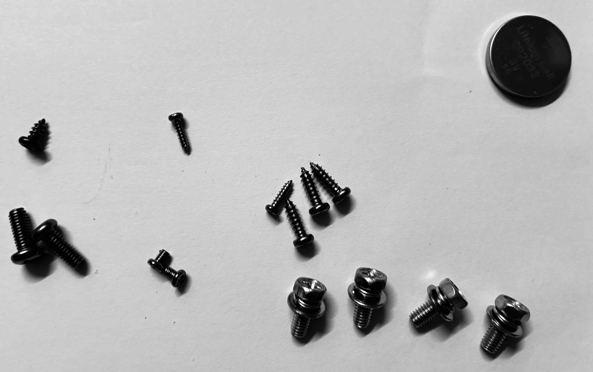
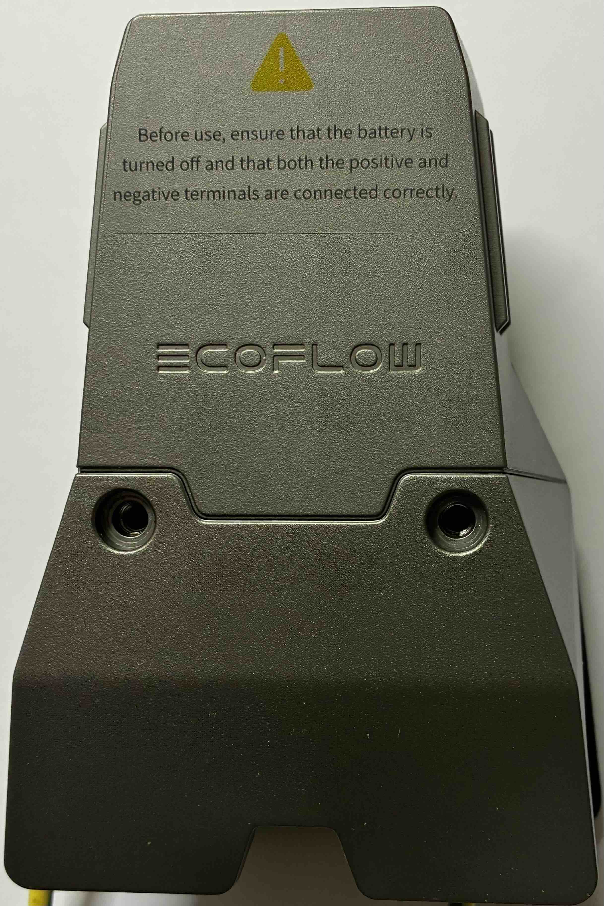
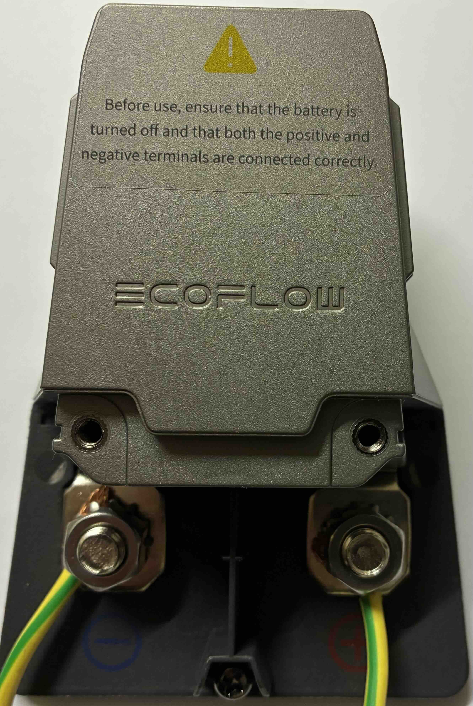
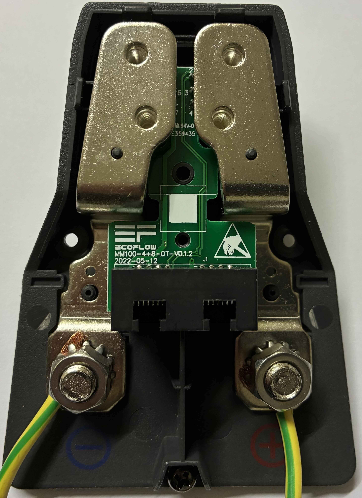

# EcoFlow LFP Battery Adapter & Termination

This guide covers the teardown and pinout exploration of the EcoFlow LFP Battery Adapter and the proprietary communication protocols used to activate the battery.

## 🔌 LFP Battery Adapter Overview

The EcoFlow LFP Battery Adapter is used to connect **Delta Pro Extra Batteries (LFP)** to third-party 48V/60V inverters or the EcoFlow Power Kits. 

*Official diagram showing RJ45 ports, power studs, and the LFP female battery port.*

### Activation logic
Normally, the battery terminal is "dead" (0V) until a handshake is performed via the communication pins. 

According to community measurements and teardowns:
*   **Pins 4 and 5** on the communication interface are internally shorted within the adapter.
*   By shorting **Pin 4** and **Pin 5**, the BMS (Battery Management System) activates the main MOSFETs.
*   Once pins 4 and 5 are bridged, the main terminals will output nominal voltage (approx. **51.2V - 58V** depending on SoC).

> [!WARNING]
> **DANGER**: Always use a fuse when bypassing safety checks. Shorting wrong pins can permanently damage the BMS or cause a fire.

---

## 🛠 Technical Pinout & Wiring

The adapter serves as a bridge between the battery's proprietary signal interface and standard **RJ45 CAN Bus** ports.

### Signal Connector (8-Pin)
*Orientation: Tab at the top, pins numbered **right to left (1 to 8)**.*

| Pin | Mapping | Function |
| :--- | :--- | :--- |
| **1** | RJ45 Pins 1 | **CAN Data Pair** (See Terminator) |
| **2** | RJ45 Pins 2 | **CAN Data Pair** (See Terminator) |
| **3** | RJ45 Pins 7 | Signal / Ground ? |
| **4** | RJ45 Pins 4 | **Bridge to Pin 5 (Activate Battery)** |
| **5** | RJ45 Pins 4 | **Bridge to Pin 4 (Activate Battery)** |
| 6 | N/C | Not Connected |
| 7 | N/C | Not Connected |
| **8** | RJ45 Pins 5 & 8 | Signal / Ground ? |

---

### RJ45 CAN Bus Ports
The adapter features two parallel RJ45 ports. These are used for daisy-chaining multiple batteries or connecting to the EcoFlow Power Kit Console/Wireless Dongle.

**Internal Wiring (Adapter to RJ45):**
*   **Adapter Pin 1** → RJ45 Port 1 (Pin 1) & RJ45 Port 2 (Pin 1)
*   **Adapter Pin 2** → RJ45 Port 1 (Pin 2) & RJ45 Port 2 (Pin 2)
*   **Adapter Pin 3** → RJ45 Port 1 (Pin 7) & RJ45 Port 2 (Pin 7)
*   **Adapter Pin 4 & 5** (Shorted) → RJ45 Port 1 (Pin 4) & RJ45 Port 2 (Pin 4)
*   **Adapter Pin 8** → RJ45 Port 1 (Pins 5 & 8) & RJ45 Port 2 (Pins 5 & 8)

---

### 🔌 CAN Bus Terminator
When bypassing the official ecosystem or daisy-chaining batteries, a terminator is required on any unused RJ45 port to prevent signal reflection.

**Specifications:**
*   **Resistor:** 120 Ohm.
*   **Connection:** Bridged between **Pin 1** and **Pin 2** of the RJ45 plug.

> [!NOTE]
> Official EcoFlow documentation states: "When two or more battery packs are connected and the RJ45 CAN Bus port is not connected... a terminator **MUST** be connected to ensure proper communication."

*Official schematic for parallel connection of multiple batteries. Notice how the RJ45 chain forms a unified CAN bus across all units.*

**Manual Analysis:**
*   **Daisy Chaining**: The two RJ45 ports are strictly for CAN Bus continuity. Each battery in a parallel stack must "see" the same communication bus.
*   **Terminal Isolation**: The diagram confirms that even in parallel, the communication bus is critical for the "Master" (or the console) to manage the state of charge across all packs.

---

### Internal Photos & Assembly
The adapter is held together by screws on the underside of the housing.

*The housing uses several screws.*

---

## 💡 DIY Implementation
If you don't have the official adapter, you can use a custom jumper on the 8-pin connector (Shorting 4 and 5) to wake up the battery for use with generic 48V systems.

**Voltage Check:**
With pins 4 and 5 shorted, verify the voltage on the main terminals:
- **Nominal:** ~51.2V (LFP 16S)
- **Full Charge:** ~58.4V

### 🛠 Hardware Tips for DIY Cables
*   **Power Connectors:** Observations show that the high-power terminals inside the proprietary battery port are physically compatible with **standard MC4 (Solar) connector pins**. 
*   **Compatibility:** The larger internal sockets in the terminal appear to match the metal inserts used in MC4 connectors. 

> [!CAUTION]
> **CURRENT LIMITATIONS**: While MC4 pins may fit physically, the original EcoFlow adapter terminals are designed for significantly higher currents (often 50A-80A continuous). Standard MC4 pins are typically rated for 20A-30A. 
> 
> If you use MC4 pins for a DIY cable:
> 1.  **Monitor temperatures** closely during high-load charging/discharging.
> 2.  **Understand the power limits** of your specific connector.
> 3.  **Risk of melting**: Drawing 80A through a 30A-rated pin will lead to overheating, melting of the connector, and potential fire. 
> 
> Only use this method for low-power applications or under strictly controlled conditions.
